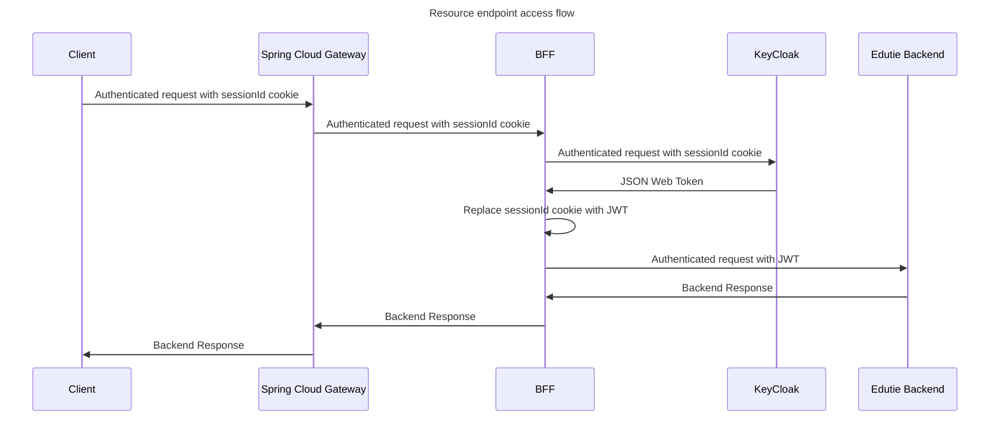

# Authentication & Authorization docs

Authentication of the users is handled by external system in the BFF authentication architecture.

## Logging in

Sample login flow:
1. Request with login credentials is sent by a client
2. Request passes through a Spring cloud gateway tunnel
3. Request is handled regarding user authentication by a BFF system
   1. Credentials are passed to KeyCloak system
   2. Credentials are verified. If verification is successful session details are stored in KeyCloak DB and session id is returned to BFF system
4. BFF system establishes a session cookie with the client regarding the provided sessionId 

Logging in as well as registering does not invoke any endpoints in the EdutieBackend (this) Application. All authentication handling
is done on the Client-Keycloak line through the middleman systems. 

<!-- TODO: Verify login flow -->

## Resource endpoint access

To access endpoints one must be authenticated & authorized. The flow is more sophisticated:
1. Authenticated request is sent by a client using existing session
2. Request passes through Spring Cloud Gateway tunnel
3. Request is received by BFF system
4. The request to the Edutie Backend application is made
   1. In most cases the token will not be valid, thus 401 response will be returned from the backend. The flow will continue and proceed to step 5.
   2. If the token is valid, it is accepted by backend application and the backend response is returned. The flow ends here.
5. Considering the token is not valid, BFF system requests the new token using the associated refresh token
6. BFF system obtains new token pair and uses the valid access token to form request
7. The request enhanced with the Authorization header containing JWT is sent to the backend application

From now on, API layer issues internal authorization mechanisms described below.

## Internal authorization

Edutie Backend Application stores data in its database regarding edutie context about the user. Thus, Edutie stores users role profiles and let them.
1. JWT is decoded. The important claims for us is the `SUB` (subject) claim, which is the user identifier. Its uniqueness allows us to distinct users.
2. UserId is used to check if the role profile required to perform the operation exists.
3. If it exists, operation is performed and its result is returned. Otherwise, response "Forbidden" is returned.
