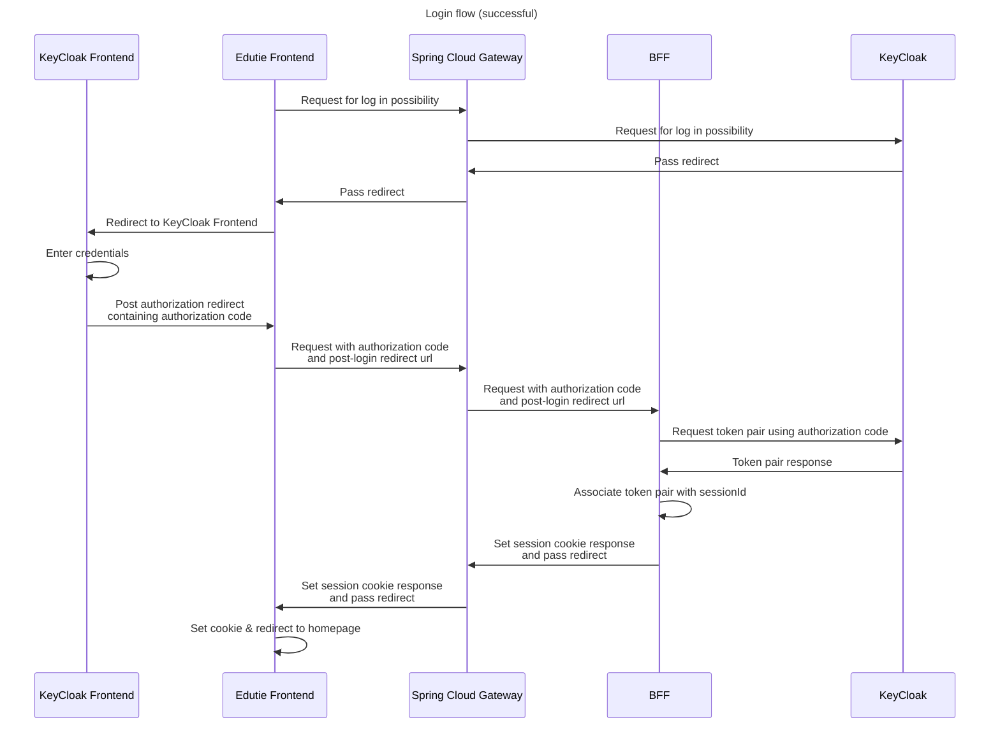
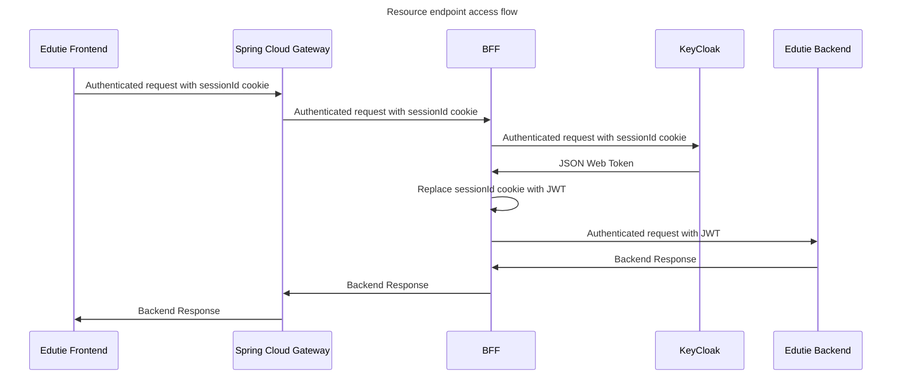

<!-- TOC -->
* [Authentication](#authentication)
  * [Logging in](#logging-in)
  * [Resource endpoint access](#resource-endpoint-access)
* [Authorization](#authorization)
  * [Internal process](#internal-process)
  * [Authorization roles](#authorization-roles)
    * [Administrator](#administrator)
    * [Educator](#educator)
    * [Student](#student)
<!-- TOC -->

# Authentication

Authentication of the users is handled by external system in the BFF authentication architecture.

## Logging in

Logging in as well as registering does not invoke any endpoints in the EdutieBackend (this) Application. All authentication handling
is done on the Client-Keycloak line through the middleman systems. 

## Resource endpoint access

To access endpoints one must be authenticated & authorized. The flow is more sophisticated:
1. Authenticated request is sent by a client using existing session
2. Request passes through Spring Cloud Gateway tunnel
3. Request is received by BFF system
4. The request to the Edutie Backend application is made
   1. In most cases the token will not be valid, thus 401 response will be returned from the backend. The flow will continue and proceed to step 5.
   2. If the token is valid, it is accepted by backend application and the backend response is returned. The flow ends here.
5. Considering the token is not valid, BFF system requests the new token using the associated refresh token
6. BFF system obtains new token pair and uses the valid access token to form request
7. The request enhanced with the Authorization header containing JWT is sent to the backend application

From now on, API layer issues internal authorization mechanisms described below.

# Authorization

In the edutie application context standalone roles are separated. Thus, authorization server (keycloak) roles are not strictly related to edutie roles and role profiles 

Since Edutie application does not distinguish roles and role profiles, the profile is interpreted as a role.

## Internal process

Edutie Backend Application stores data in its database regarding edutie context about the user. Thus, Edutie stores users role profiles and let them.
1. JWT is decoded. The important claims for us is the `SUB` (subject) claim, which is the user identifier. Its uniqueness allows us to distinct users.
2. UserId is used to check if the role profile required to perform the operation exists.
3. If it exists, operation is performed - query or command is handled - and the operation result is returned. Otherwise, response "Forbidden" is returned.

## Authorization roles

Above authorization process encompasses role profiles and their presence. 

### Administrator

Administrator role as of this moment is "borrowed" from the authorization server. 
This role is assigned automatically when administrator authorization server role is reflected in the incoming JWT.

### Educator

Educator role can be assigned to user by an administrator, therefore it is a **restricted role**. Educator role profile is a profile for users that create content in the application.

### Student

Student is a default role for users. It is assigned automatically to every user, if the flow requiring this role is invoked.
