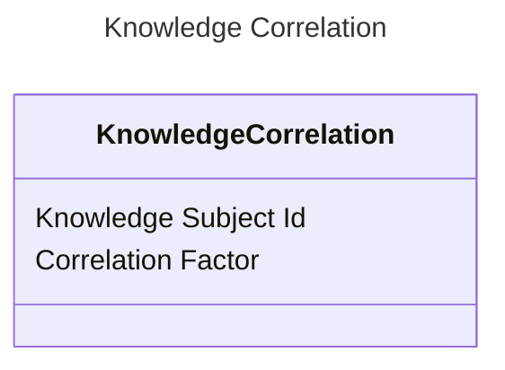

<!-- TOC -->

* [Knowledge Correlation](#knowledge-correlation)
    * [Contained data:](#contained-data)
        * [Knowledge subject Id](#knowledge-subject-id)
        * [Correlation Factor](#correlation-factor)
    * [Sample visualisation:](#sample-visualisation)
    * [References](#references)

<!-- TOC -->

# Knowledge Correlation

Knowledge Correlation is an entity indicating learning requirement's knowledge subject (wiki page) relation to other
knowledge subjects.
It does not typically occur in the singular form. It is used as a response from knowledge map system for getting
knowledge
correlations using given knowledge subject id.

## Contained data:

### Knowledge subject Id

The identity of correlated knowledge subject. As Learning Requirements are related with a knowledge subject, the
correlation
is also about the learning requirement that is related to knowledge subject of this id.

### Correlation Factor

The factor that represents how much given subject is correlated.

The less the correlation factor, the more the subject represented by above identity is correlated to the subject that
invoked the flow.

## Sample visualisation:

## References

Find more information in here: https://github.com/EdutieProject/Dokumentacja/blob/main/projekty/edutie/Edukacja.md
