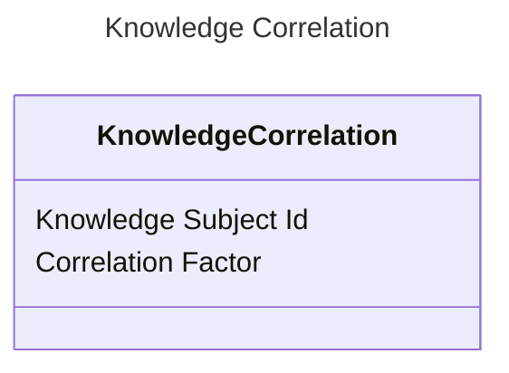

<!-- TOC -->
* [Knowledge Correlation](#knowledge-correlation)
  * [Contained data:](#contained-data)
    * [Knowledge subject Id](#knowledge-subject-id)
    * [Correlation Factor](#correlation-factor)
  * [Sample visualisation:](#sample-visualisation)
  * [References](#references)
<!-- TOC -->

# Knowledge Correlation
Knowledge Correlation is an entity indicating of learning requirement's knowledge subject (wiki page) relation to other knowledge subjects.
It does not occur in the singular form. It is used as a response for getting knowledge correlations using given knowledge subject id.

Each relation is graded with 1-10 scale.

## Contained data:
### Knowledge subject Id
The identity of correlated knowledge subject

### Correlation Factor
The factor that represents how much given subject is correlated.

The less the correlation factor, the more the subject represented by above identity is correlated to the subject that
invoked the flow.

## Sample visualisation:

## References
Find more information in here: https://github.com/EdutieProject/Dokumentacja/blob/main/projekty/edutie/Personalizacja.md