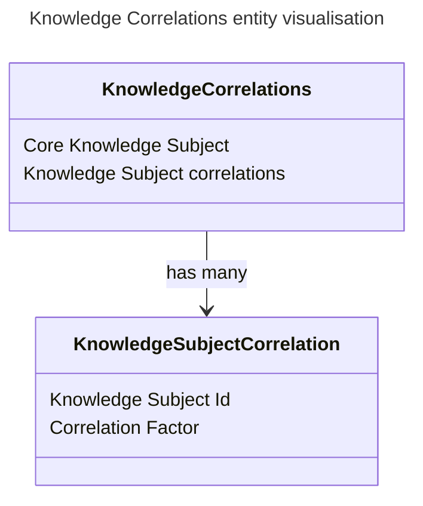

<!-- TOC -->
* [Knowledge Correlations](#knowledge-correlations)
  * [Contained data:](#contained-data)
    * [Core knowledge subject](#core-knowledge-subject)
    * [Knowledge subject correlations](#knowledge-subject-correlations)
  * [Sample visualisation:](#sample-visualisation)
  * [References](#references)
<!-- TOC -->

# Knowledge Correlations
Knowledge Correlations is an entity indicating of learning requirement's knowledge subject (wiki page) relation to other knowledge subjects.
Since every learning requirement should reference a knowledge subject, 

Each relation is graded with 1-10 scale.

## Contained data:
### Core knowledge subject
The knowledge subject which is targeted.

### Knowledge subject correlations
That is a list of pairs with knowledge subject identifier and the correlation factor.

## Sample visualisation:

## References
Find more information on LRD in here: https://github.com/EdutieProject/Dokumentacja/blob/main/projekty/edutie/Personalizacja.md