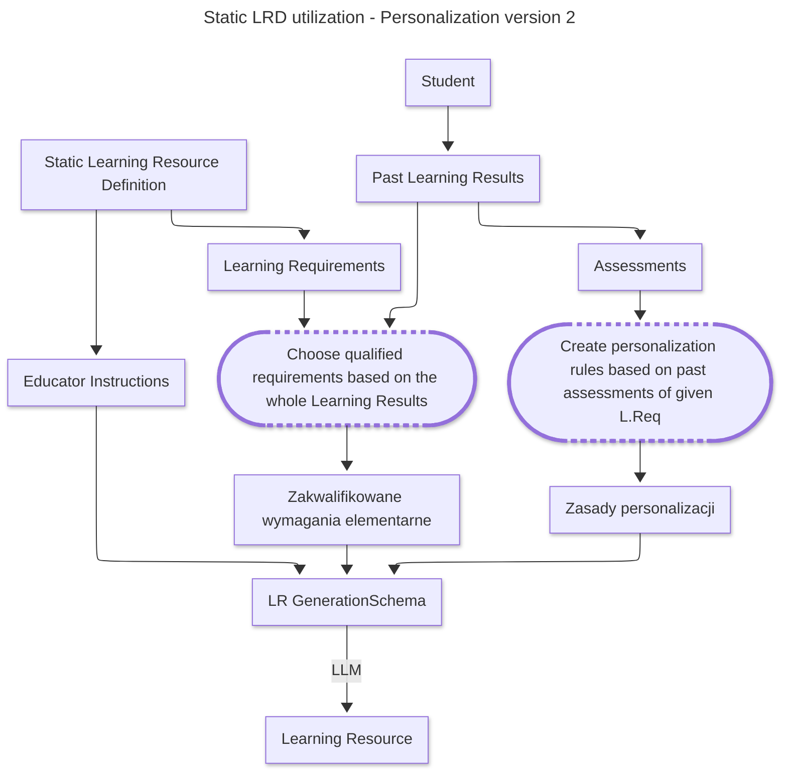

<!-- TOC -->

* [Learning Resource Definition](#learning-resource-definition)
    * [Contained data:](#contained-data)
        * [Learning requirements relationships](#learning-requirements-relationships)
        * [Theory context sources](#theory-context-sources)
        * [Activity context sources](#activity-context-sources)
    * [References](#references)

<!-- TOC -->

# Learning Resource Definition

Learning resource definition is a scheme from which personalized Learning Resource can be created.

## Contained data:

### Learning requirements relationships

Learning Resource Definition has access to Learning Requirements references.
That is a many-to-many relationship. There must be at least 1 learning requirement related to the definition for it to
be functional.

Learning requirements are the primary descriptors of what the LR should require from the student. Therefore, they are
the most important when it comes to the true knowledge student exercises.

### Educator instructions

These are the additional instructions given from educator for LR generation. These encompass:
 - Theory context instructions - instructions applied for theory generation
 - Activity instructions - analogous to the previous one

## Implementations

LRD can be implemented in various ways.

### Static Learning Resource Definition

The static one is an LRD created by an Educator to serve as an absolute material definition in a study program element.

Thus, it is static, meaning that it is stored and its state can be changed because it *exists*. For instance, in the
course created by an educator.

Below - a scheme of how static LRD works in terms of LR creation.

### Dynamic Learning Resource Definition

The dynamic one is similar to the static, however it is not persisted as it is created dynamically based on dynamically
provided learning requirements. Moreover, it has no Educator instructions associated with it.

> *Schemes TBD*

## References

Find more information in here: https://github.com/EdutieProject/Dokumentacja/blob/main/projekty/edutie/Personalizacja.md
