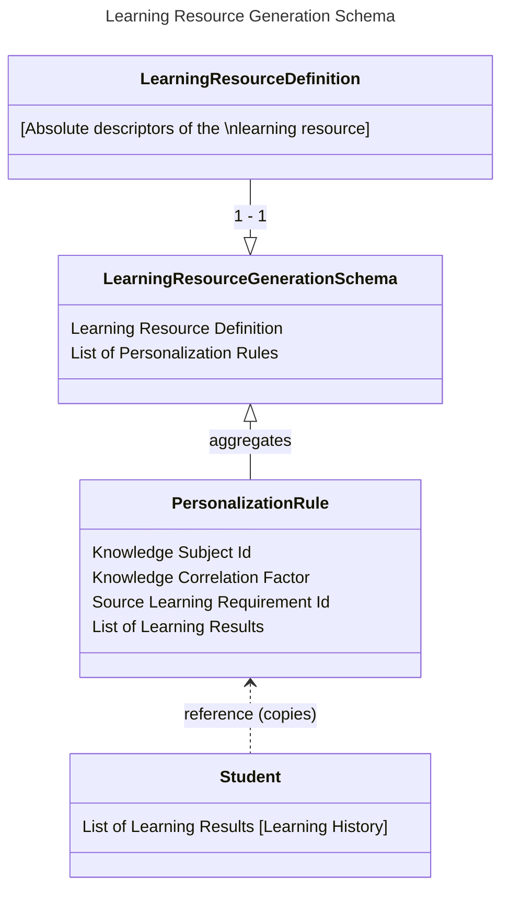

<!-- TOC -->
* [Learning Resource Generation Schema](#learning-resource-generation-schema)
  * [Contained data:](#contained-data)
    * [Learning Resource Definition](#learning-resource-definition)
    * [Personalization Rules](#personalization-rules-)
  * [Visual representation](#visual-representation)
  * [References](#references)
<!-- TOC -->

# Learning Resource Generation Schema
Learning resource generation schema is a schema with all the data required to generate Learning Resource. 
This entity is read-only as it is meant only to be created and passed to the LLM to generate the learning resource.

## Contained data:

### Learning Resource Definition
This entity embeds learning resource definition as the LR definition contains the necessary information.

Learning resource definition also contains all learning requirements which are essential in LR generation.

### Personalization Rules 
Personalization rules are the descriptors of personalization that is to be made by LLM.

Each personalization rule correspond to the knowledge correlation previously provided by Wikimap 

They are compounded of:
 - Knowledge Subject Id (referencing the "related" Knowledge subject)
 - Knowledge Correlation Factor
 - Source learning requirement Id (should overlap with some LR Definition learning requirement) - this is the learning requirement for which this personalization rule is created
 - Qualified sub-requirements - those indicate what amount of sub requirements are qualified to be implemented from the referenced source learning requirement
 - List of Learning Results that correspond to the knowledge subject. Those should be represented as a LRGS-specific view. Thus, their contents would be:
   - Learning result's feedback
   - Learning result's assessments

## Visual representation

## References
Find more information on LRD in here: https://github.com/EdutieProject/Dokumentacja/blob/main/projekty/edutie/Personalizacja.md