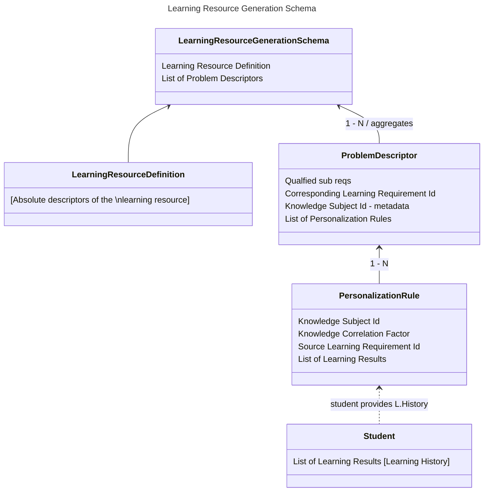

<!-- TOC -->

* [Learning Resource Generation Schema](#learning-resource-generation-schema)
    * [Contained data:](#contained-data)
        * [Learning Resource Definition](#learning-resource-definition)
        * [Problem Descriptors](#problem-descriptors)
            * [Personalization Rules](#personalization-rules)
    * [Visual representation](#visual-representation)
    * [References](#references)

<!-- TOC -->

# Learning Resource Generation Schema

Learning resource generation schema is a schema with all the data required to generate Learning Resource.
This entity is read-only as it is meant only to be created and passed to the LLM to generate the learning resource.

## Contained data:

### Learning Resource Definition

This entity embeds learning resource definition as the LR definition contains the necessary information.

Learning resource definition also contains all learning requirements which are essential in LR generation.

### Problem Descriptors

During the generation process Learning Requirements from Learning Resource Definition are being considered as a
problem source. Therefore, every Learning Requirement produces a Problem Descriptor. The reference is kept using both
the corresponding learning requirement id and its knowledge subject id as well.

Problem descriptors contain information about the sub-requirements that are qualified to be a part of the problem. Thus,
they are not constant and are a part of personalization.

Problems have personalization rules.

#### Personalization Rules

Personalization rules are the descriptors of personalization that is to be made by LLM under the problem construction.

Personalization rules correspond to knowledge correlations provided by Wiki-map. Those are requested using
the knowledge subject identity of the problem descriptor L.Req.

They are compounded of:

- Related Knowledge Subject Id (referencing the related Knowledge Subject). This should be treated as metadata.
- Knowledge Correlation Factor
- List of Learning Results that correspond to the knowledge subject. Those should be represented as a LRGS-specific
  view. Thus, their contents would be:
    - Learning result's feedback
    - Learning result's assessments

## Visual representation

## References

Find more information in here: https://github.com/EdutieProject/Dokumentacja/blob/main/projekty/edutie/Personalizacja.md
