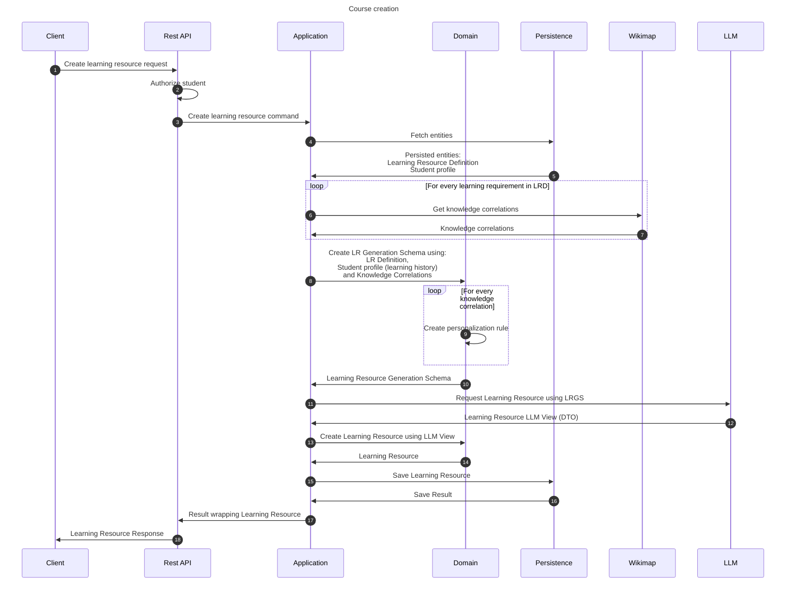

# Create learning resource flow
This flow creates personalized, dedicated learning resource for a student.

## Sequence diagram

## Input data

| Input                           | Type                            | Required |
|---------------------------------|---------------------------------|----------|
| Student Id                      | Student Id                      | ✅        |
| Learning Resource Definition Id | Learning Resource Definition Id | ✅        |

## Description
This flow creates a learning resource. It is created using learning resource definition and a student profile.

Learning resource is created by constructing Learning Resource Generation Schema.
Let's describe the algorithm behind the LRGS creation:
1. Input data: Student id and Learning Resource Definition id
2. Load the data - student profile and LR Definition
3. For each Learning Requirement in LR Definition:
   1. Get Knowledge Subject Id from learning requirement
   2. Using Knowledge Subject Id, retrieve Knowledge Correlations from Wikimap
   3. For each knowledge correlation create Personalization Rule
      - using the knowledge correlation (spread properties)
      - using the student's learning history learning results
      - calculating qualified sub-requirements
4. Using the created Personalization Rules and the LR Definition create Learning Resource Generation Schema

The LRGS is sent to the LLM and the response is being restructured to match Learning Resource.