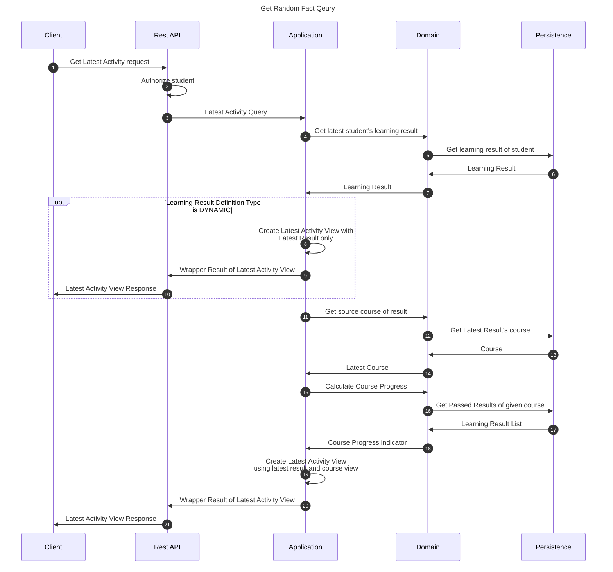

# Get Latest Activity

This ancillary flow is responsible for providing latest activity indicators for the student invoking the flow.

## Sequence diagram

## Input data

| Input                    | Type            | Required |
|--------------------------|-----------------|----------|
| Student Id               | UUID Identifier | ✅        |

## Description

Flow retrieves the latest activity view encompassing latest activity descriptors such as:
 - Latest learning result
 - Latest Course View consisting of the course itself and a course progress indicator