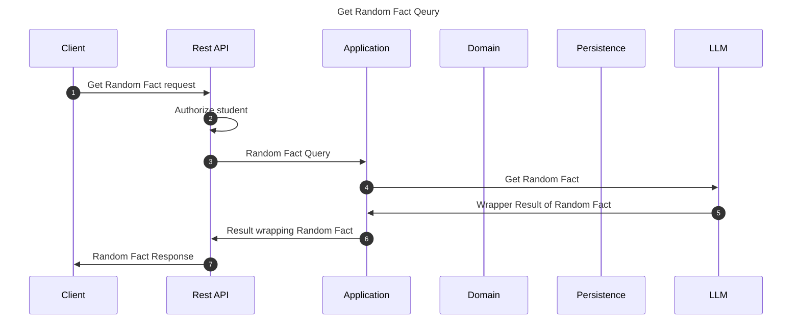

# Get Random Fact flow

This ancillary flow is responsible for providing a random fact for a student which may be somewhat
related to the latest problems regarding the past learning process.

## Sequence diagram

## Input data

| Input                    | Type            | Required |
|--------------------------|-----------------|----------|
| Student Id               | UUID Identifier | ✅        |

## Description

Flow retrieves a random fact that should be somewhat interesting and useful in educational context.
In the future flow may be extended and the retrieved fact would be then related to past results. 