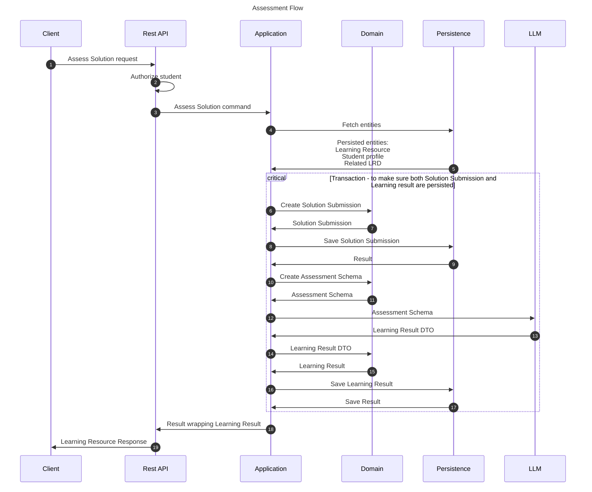

# Assess Solution flow
This flow is responsible for student's work assessment. It creates Solution Submission as well as corresponding 
Learning Result.

## Sequence diagram

## Input data

| Input                    | Type                 | Required |
|--------------------------|----------------------|----------|
| Student Id               | Student Id           | ✅        |
| Learning Resource Id     | Learning Resource Id | ✅        |
| Solution Submission Text | String               | ✅        |
| Hints Revealed Count     | Integer              | ✅        |

## Description
This flow assesses student's work. Let's break it down into steps:
1. Fetch needed entities from persistence
2. Create a Solution Submission entity 
3. Save Solution Submission.
4. Create Assessment Schema using Solution Submission, LR and LRD
5. Send the DTO to LLM service
6. Let LLM assess the work:
   1. LLM assesses the work according to each problem generated. The information for each problem is in stored in the LR.
   2. Qualified sub requirements must be accounted for when assessing regarding each learning requirements 
     - Therefore, assessments must also include the info how many sub reqs are assessed
     - Furthermore, assessment's grade represents the assessment of work that was made for the qualified sub reqs.
7. Group the assessments and pack them into Learning Result. 