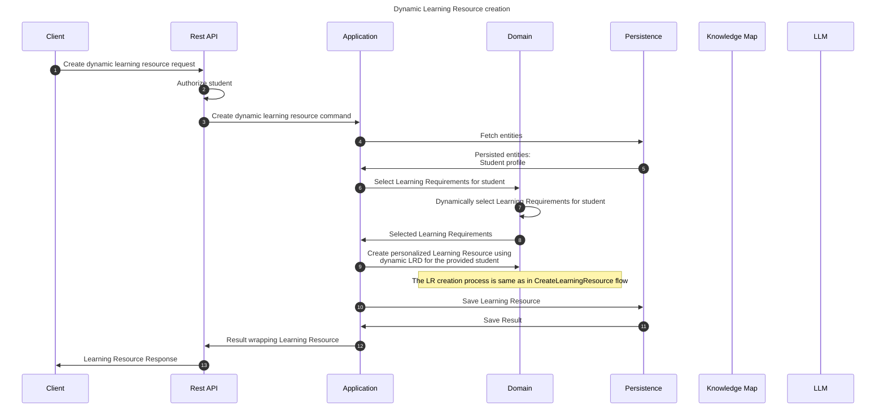

# Create dynamic learning resource flow

This flow creates personalized, dedicated learning resource for a student using a provided context that is referred in
the learning resource's contents.

*This flow is overlapping with create learning resource flow. Therefore, this doc is mostly similar to the other one.*
## Sequence diagram

## Input data

| Input           | Type            | Required |
|-----------------|-----------------|----------|
| Student Id      | UUID Identifier | ✅        |
| Context         | String          | ✅        |
| Invocation Mode | Enum            | ✅        |

## Description

This flow dynamically creates a learning resource definition, which is later used to produce a dynamic learning resource. 

For now, invocation mode is by default an only mode - the random fact mode. However, it will be expanded in the future
and so will be the flow considering other invocation types. 

The L.R.G.S. creation is more widely described [here](CreateLearningResource.md)
