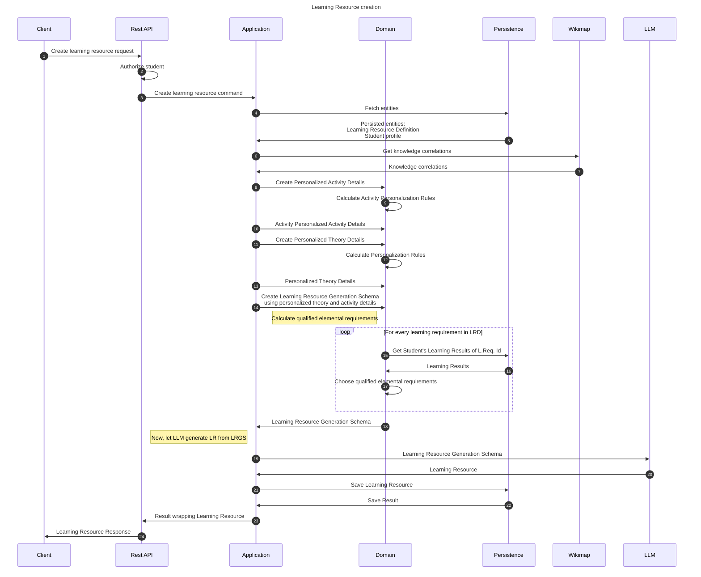

# Create learning resource flow

This flow creates personalized, dedicated learning resource for a student using a Learning Resource Definition.

## Sequence diagram

## Input data

| Input                           | Type            | Required |
|---------------------------------|-----------------|----------|
| Student Id                      | UUID Identifier | ✅        |
| Learning Resource Definition Id | UUID Identifier | ✅        |

## Description

This flow creates a learning resource. It is created using learning resource definition and a student profile.

Learning resource is created by constructing Learning Resource Generation Schema.
Let's describe the algorithm behind the LRGS creation:

1. Input data: Student id and Learning Resource Definition id
2. Load the data - student profile and LR Definition
3. Create a Learning Resource Generation schema:
   1. For each learning requirement calculate the amount of qualified elemental requirements and add them to the LRGS
   2. Create Personalized Activity Details
      - Use activity prompts provided in the Learning Resource Definition
      - Create Activity Personalization Rules using Knowledge map
   3. Create Personalized Theory Details
       - Use theory prompts provided in the Learning Resource Definition
       - Create Theory Personalization Rules using Knowledge map

Personalized theory & activity details may be offloaded as they can be created separately

The LRGS is sent to the LLM and the response is being restructured to match Learning Resource.