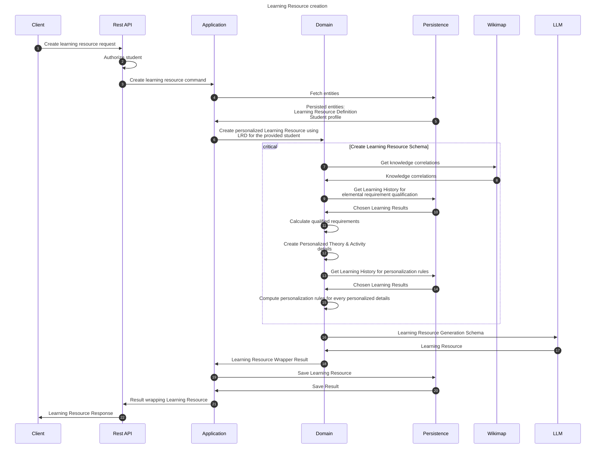

# Create learning resource flow

This flow creates personalized, dedicated learning resource for a student using a Learning Resource Definition.

## Sequence diagram

## Input data

| Input                           | Type            | Required |
|---------------------------------|-----------------|----------|
| Student Id                      | UUID Identifier | ✅        |
| Learning Resource Definition Id | UUID Identifier | ✅        |

## Description

This flow creates a learning resource. It is created using learning resource definition as an absolute definition
and a student's learning history for personalization purposes.

1. Input data: Student id and Learning Resource Definition id
2. Load the data - student profile and LR Definition
3. Create a Personalized Learning Resource:
    1. Fetch knowledge correlations from knowledge map
    2. Create Learning Resource Generation Schema
        1. Compute qualified learning requirements using recent learning history
        2. Create Personalized Activity Details
            - Use activity prompts provided in the Learning Resource Definition
            - Create Activity Personalization Rules using Knowledge map
        3. Create Personalized Theory Details
            - Use theory prompts provided in the Learning Resource Definition
            - Create Theory Personalization Rules using Knowledge map
    3. Use LLM to generate LR dto from LRGS
    4. Create Learning Resource from the DTO
4. Save & return the LR.

Personalized theory & activity details may be offloaded as they can be created separately

The LRGS is sent to the LLM and the response is being restructured to match Learning Resource.