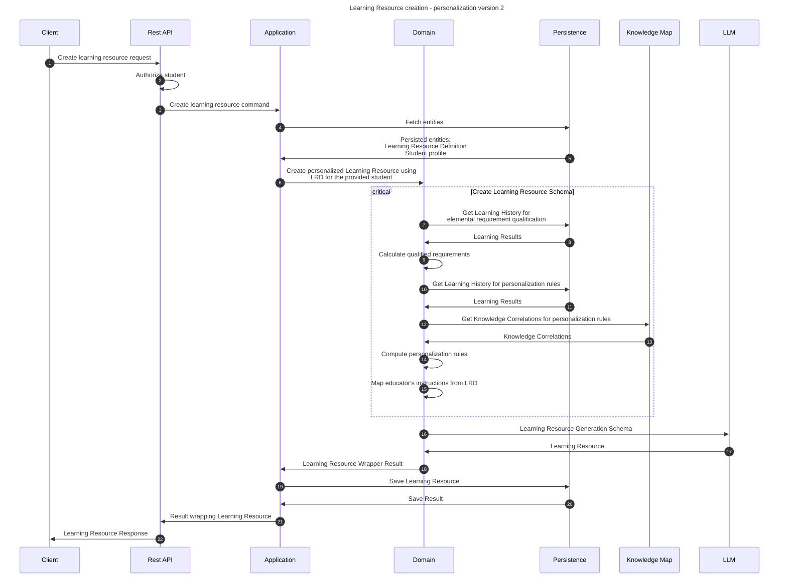

# Create learning resource flow

This flow creates personalized, dedicated learning resource for a student using a Learning Resource Definition.

## Sequence diagram

## Input data

| Input                           | Type            | Required |
|---------------------------------|-----------------|----------|
| Student Id                      | UUID Identifier | ✅        |
| Learning Resource Definition Id | UUID Identifier | ✅        |

## Description

This flow creates a learning resource. It is created using static learning resource definition as an absolute definition
and student's learning history for personalization purposes.

1. Input data: Student id and Learning Resource Definition id
2. Load the data - student profile and LR Definition
3. Create a Personalized Learning Resource:
   1. Create Learning Resource Generation Schema
      1. Compute qualified learning requirements using recent learning history:
         - Mathematical function may be used for difficulty stage computing. F: Grade list -> Percentage of L.Req. qualification
      2. Create personalization rules:
         - Get the latest Learning Results. Could be up to week ago or sth like that.
         - Choose personalization types qualified for the LR. Base the choice on meeting the criteria with the latest Learning Result list.
         - If more than 2 personalization types are qualified, randomize the choice by choosing only 2 of them.
         - Search for assessments in the latest learning result list that satisfy the personalization type condition. Let the assessments be of strong correlation with the activity learning requirements.
         - Create a personalization rule using a Feedback and a personalization context from the given strategy.
      3. Map Educator Instructions to Additional Instructions 
   2. Use LLM to generate LR dto from LRGS
   3. Create Learning Resource from the DTO
4. Save & return the LR.

The LRGS is sent to the LLM and the response is being restructured to match Learning Resource.