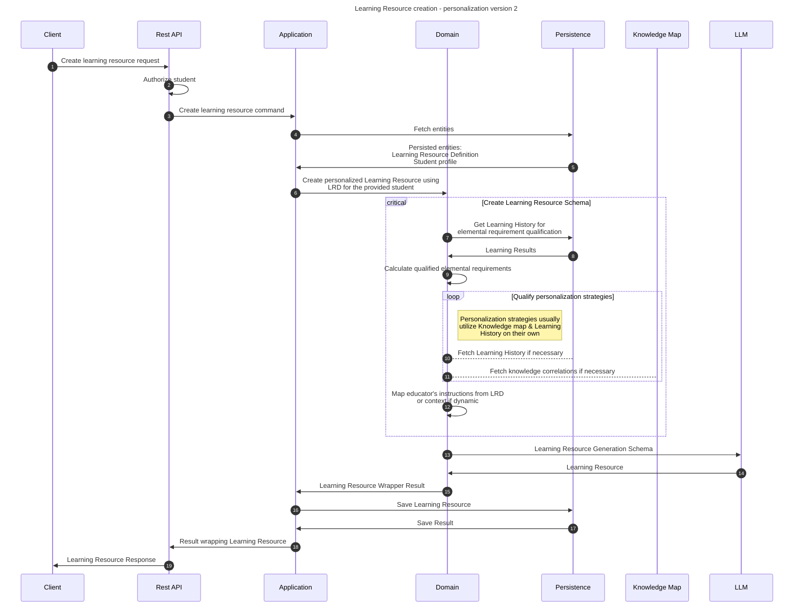

# Create learning resource flow

This flow creates personalized, dedicated learning resource for a student using a Learning Resource Definition. This doc
also briefly mentions the dynamic case scenario.

## Sequence diagram

## Input data

| Input                           | Type            | Required |
|---------------------------------|-----------------|----------|
| Student Id                      | UUID Identifier | ✅        |
| Learning Resource Definition Id | UUID Identifier | ✅        |

## Description

This flow creates a learning resource. It is created using static learning resource definition as an absolute definition
and student's learning history for personalization purposes.

1. Input data: Student id and Learning Resource Definition id
2. Load the data - student profile and LR Definition
3. Create a Personalized Learning Resource:
   1. Create Learning Resource Generation Schema
      1. Compute qualified learning requirements using recent learning history
      2. Create personalization rules:
         - Get the latest Learning Results.
         - Choose personalization strategies qualified for the LR. Each strategy has their own qualification criteria and priority.
         - Strategy qualification creates a personalization rule for the personalization schema (LRGS)
      3. Map relevant additional context to the schema.
   2. Use LLM to generate LR dto from LRGS
   3. Create Learning Resource from the DTO
4. Save & return the LR.

The LRGS is sent to the LLM and the response is being restructured to match Learning Resource.