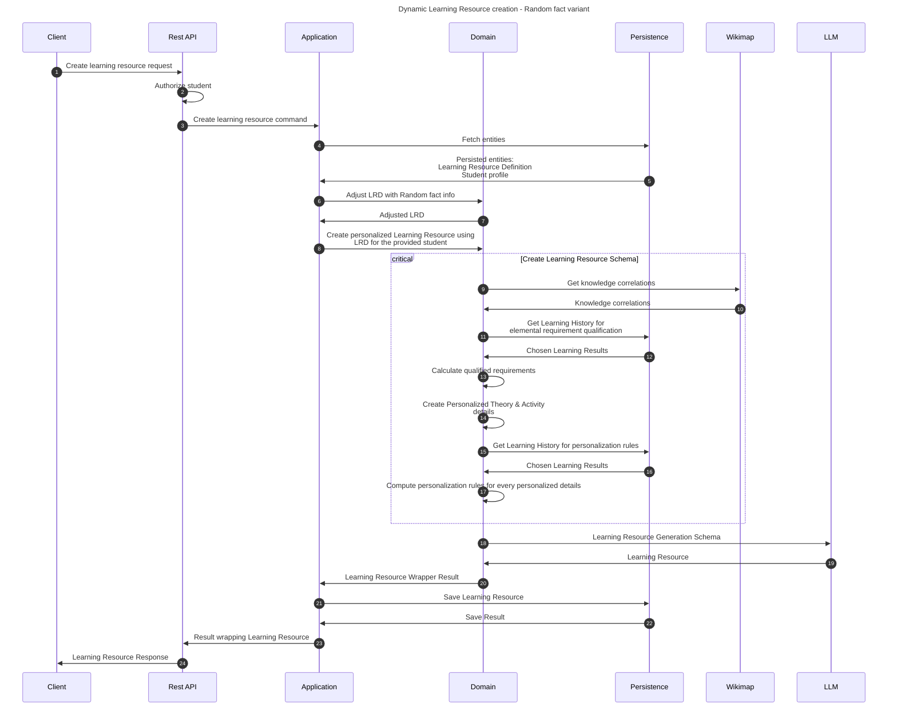

# Create random fact dynamic learning resource flow

This flow creates personalized, dedicated learning resource for a student using a random curious fact potentially obtained
previously in the ancillary random fact flow.

*This flow is overlapping with create learning resource flow. Therefore, this doc is mostly similar to the other one. This problem
shall be solved in the future under [this GH issue](https://github.com/EdutieProject/edutie-backend/issues/217)*

## Sequence diagram

## Input data

| Input       | Type            | Required |
|-------------|-----------------|----------|
| Student Id  | UUID Identifier | ✅        |
| Random Fact | String          | ✅        |

## Description

This flow dynamically creates a learning resource definition, which is later used to produce a learning resource. 

As of now, the dynamic LRD is created just in a way that the Learning Requirements are copied from the latest Learning
Result. Thus, the LRD is just a middleman in producing a similar Learning Resource to the latest one but accounting for
the random fact that may have made the student interested.

The L.R.G.S. creation is more widely described [here](CreateLearningResource.md)
