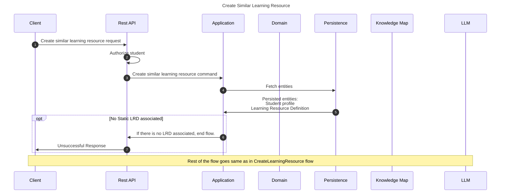

# Create dynamic learning resource flow

This flow creates personalized, dedicated learning resource for a student using another learning resource id. The flow
is created either by using the same definition. Therefore, the flow does not support dynamic Learning Resources.

## Sequence diagram

## Input data

| Input                | Type            | Required |
|----------------------|-----------------|----------|
| Student Id           | UUID Identifier | ✅        |
| Learning Resource Id | UUID Identifier | ✅        |

## Description

This flow creates a similar learning resource to the one which identifier was provided as an argument. Due to the fact
that dynamic definitions are not persisted, the similar creation process supports only LRs created by static definitions.
