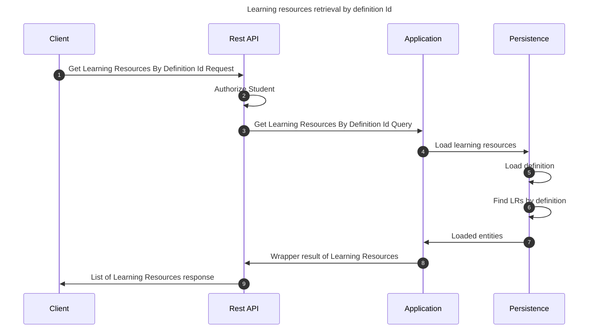

# Get learning resources by definition Id

This flow retrieves a learning resources by definition Id

## Sequence diagram

## Input data

| Input                           | Type            | Required |
|---------------------------------|-----------------|----------|
| Student User Id                 | UUID Identifier | ✅        |
| Learning Resource Definition Id | UUID Identifier | ✅        |

## Description

Flow retrieves a learning resource querying it by associated Learning Resource Definition identifier.

- User invoking the flow must be a student