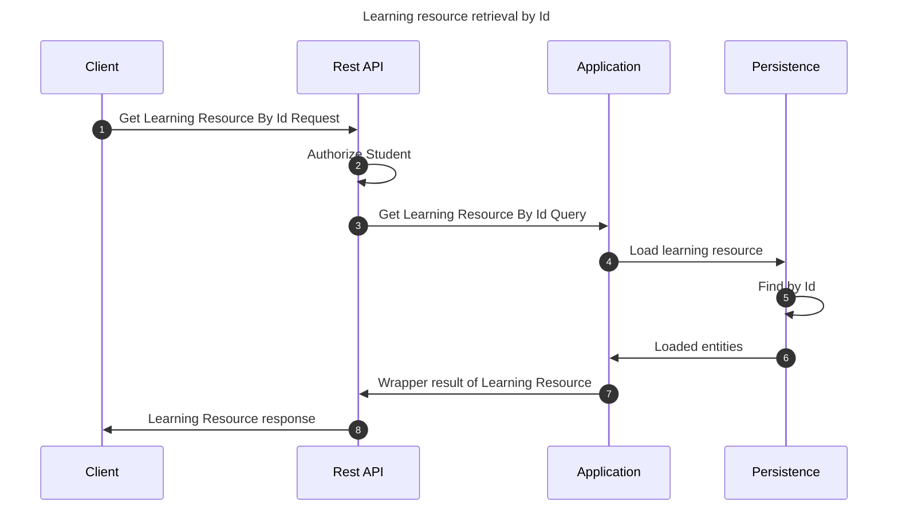

# Get learning resource by Id

This flow retrieves a learning resource by its identifier

## Sequence diagram

## Input data

| Input                | Type            | Required |
|----------------------|-----------------|----------|
| Student User Id      | UUID Identifier | ✅        |
| Learning Resource Id | UUID Identifier | ✅        |

## Description

Flow retrieves a learning resource querying it by its identifier.

- User invoking the flow must be a student