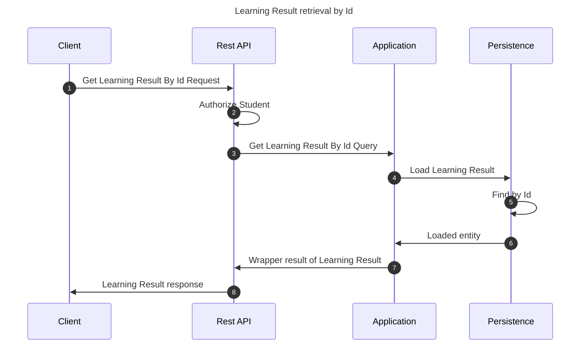

# Get Learning Result by Id

This flow retrieves a learning result by its unique identifier

## Sequence diagram

## Input data

| Input              | Type            | Required |
|--------------------|-----------------|----------|
| Student User Id    | UUID Identifier | ✅        |
| Learning Result Id | UUID Identifier | ✅        |

## Description

Flow retrieves a learning result querying it by its unique identifier.

- User invoking the flow must be a student