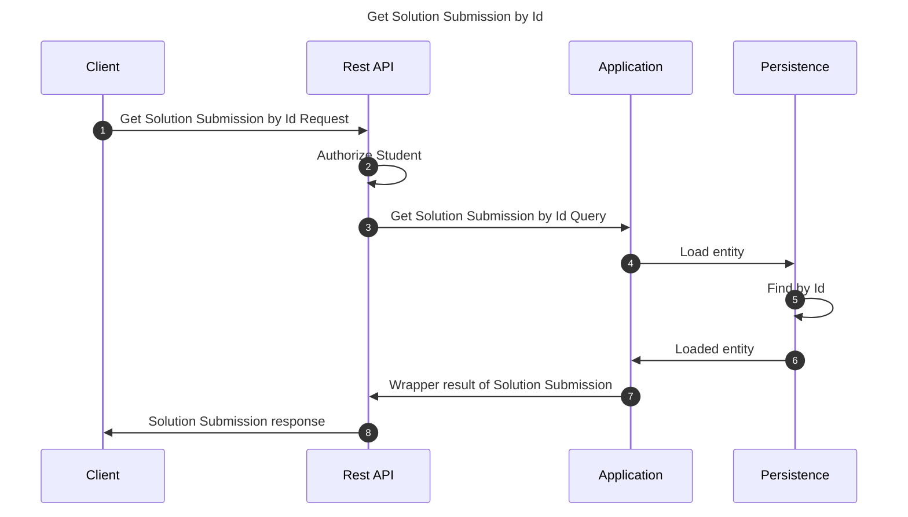

# Get Solution Submission by Id

This flow retrieves a solution submission by its unique identifier

## Sequence diagram

## Input data

| Input                  | Type            | Required |
|------------------------|-----------------|----------|
| Student User Id        | UUID Identifier | ✅        |
| Solution Submission Id | UUID Identifier | ✅        |

## Description

Flow retrieves a solution submission querying it by its unique identifier.

- User invoking the flow must be a student