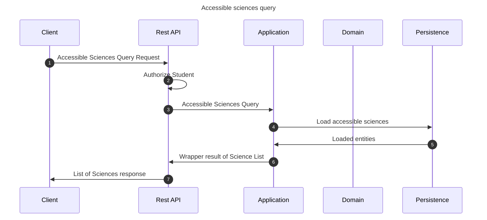

# Accessible sciences query

This flow shows accessible sciences for the student.

## Sequence diagram

## Input data

| Input           | Type            | Required |
|-----------------|-----------------|----------|
| Student User Id | UUID Identifier | ✅        |

## Description

Flow retrieves all accessible sciences.
