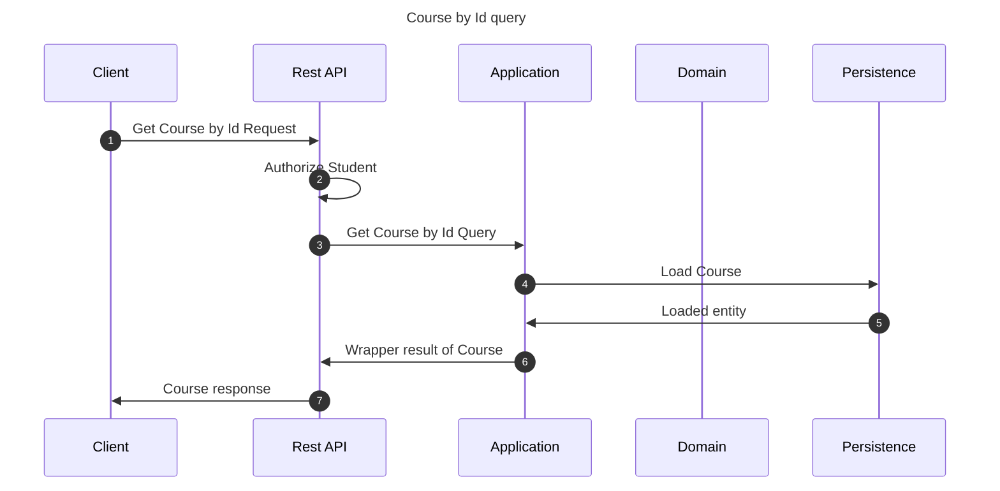

# Get Course by Id

This flow retrieves a course details by course id

## Sequence diagram

## Input data

| Input           | Type            | Required |
|-----------------|-----------------|----------|
| Student User Id | UUID Identifier | ✅        |
| Course Id       | UUID Identifier | ✅        |

## Description

Flow retrieves a course by its Id
- Flow may be invoked by any student