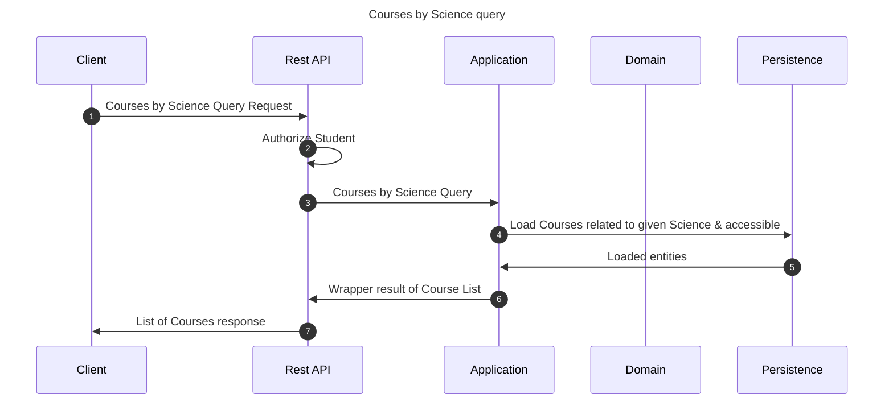

# Courses by Science query

This flow shows courses that correspond to the given science

## Sequence diagram

## Input data

| Input           | Type            | Required |
|-----------------|-----------------|----------|
| Student User Id | UUID Identifier | ✅        |
| Science Id      | UUID Identifier | ✅        |

## Description

Flow retrieves all accessible courses corresponding to given science
