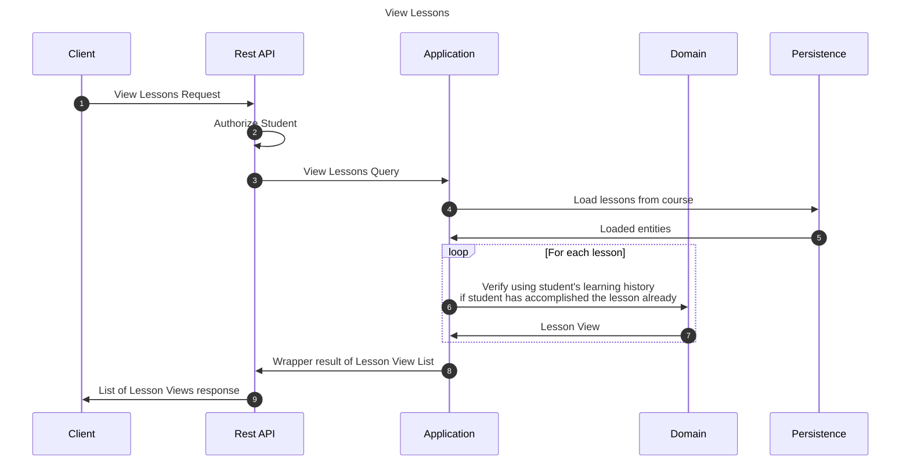

# View lessons from course query

This flow showcases the lessons from given course for the student.

## Sequence diagram

## Input data

| Input           | Type            | Required |
|-----------------|-----------------|----------|
| Student User Id | UUID Identifier | ✅        |

## Description

Flow retrieves lesson views dedicated for a student sending the request.

## Lesson View

Lesson View represents the lesson together with student's performance on it.

- It contains information whether the lesson is fully "done" by the student (if all segments are already passed).