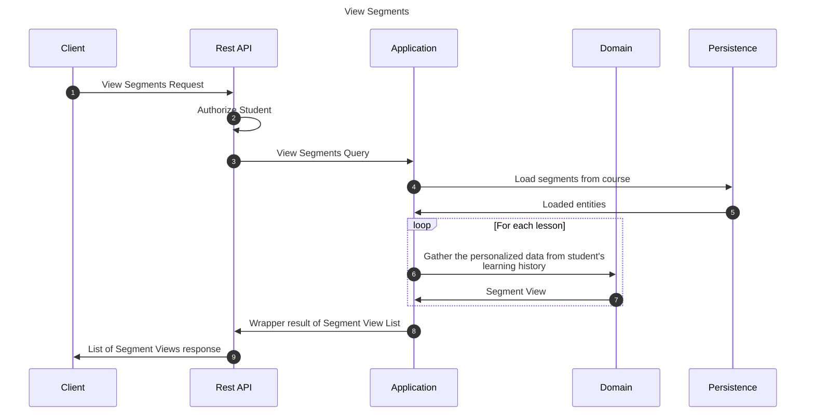

# View segments from course query

This flow showcases the lessons from given course for the student.

## Sequence diagram

## Input data

| Input           | Type            | Required |
|-----------------|-----------------|----------|
| Student User Id | UUID Identifier | ✅        |

## Description

Flow retrieves segment views dedicated for a student sending the request.

## Segment View

Segment View represents the lesson together with student's performance on it. It contains information:

- How many approaches student had on this segment (different LRs)
- How many times did he pass the segment
- What is the current difficulty that would be utilized for the next LR