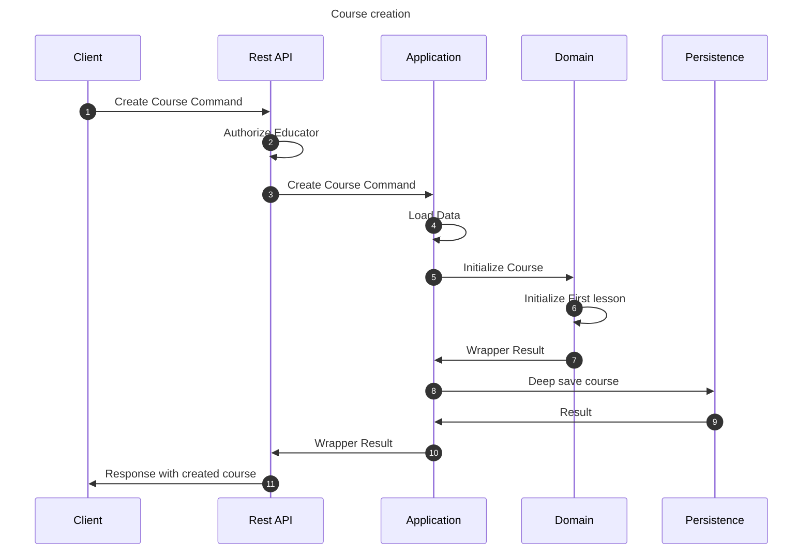

# Create course flow

This flow creates a course. This may be performed by any educator.

## Sequence diagram

## Input data

| Input              | Type            | Required |
|--------------------|-----------------|----------|
| Educator User Id   | UUID Identifier | ✅        |
| Course Name        | String          | ✅        |
| Course Description | String          | ❌        |
| Science Id         | UUID Identifier | ✅        |

## Description

Flow creates a course using provided command.
1. Course has its own properties provided in the command
2. Course is related to the Science provided by id in the command
3. Course is by default inaccessible
4. Course is initialized
   1. Course has the initial "root" lesson already created
   2. Initial lesson has the initial "root" segment already created
5. Course is associated with the educator that created it