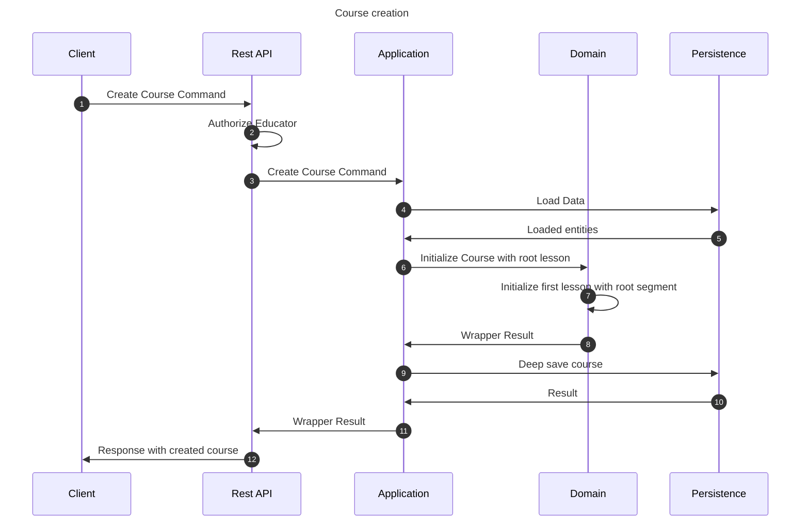

# Create course flow

This flow creates a course. This may be performed by any educator.

## Sequence diagram

## Input data

| Input              | Type            | Required |
|--------------------|-----------------|----------|
| Educator User Id   | UUID Identifier | ✅        |
| Course Name        | String          | ✅        |
| Course Description | String          | ❌        |
| Science Id         | UUID Identifier | ✅        |

## Description

Flow creates a course using provided command.
- Course uses name and description provided in the command
- Course is related to the Science provided by id in the command
- Course is related to the educator profile of a user that invoked this flow. User must have educator profile to invoke this flow and that is ensured by step 2 of the sequence diagram
- Course is by default inaccessible
- Course is initialized
   - Course has the initial "root" lesson already created
   - Initial lesson has the initial "root" segment already created
6. Course is associated with the educator that created it
