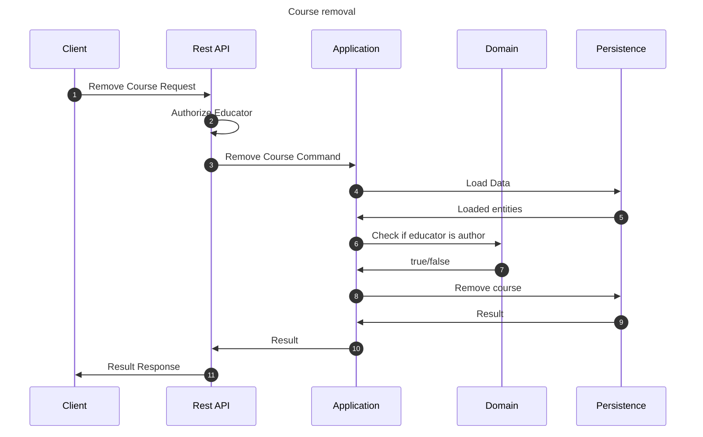

# Remove course flow

This flow removes a course. This may be performed by author educator of the course.

## Sequence diagram

## Input data

| Input              | Type        | Required |
|--------------------|-------------|----------|
| Educator User Id   | Educator Id | ✅        |
| Course Id          | Course Id   | ✅        |

## Description

Flow removes the course from the application.
 - Only course itself is being removed.
   - Underlying lessons & segments stay in the database.
 - Course may be removed only by author educator