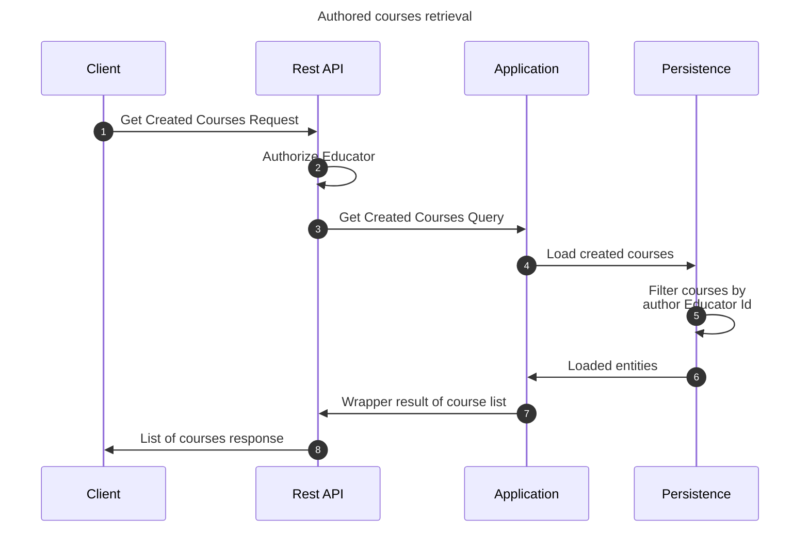

# Get created course flow

This flow retrieves created courses by an educator user. This may be performed by any educator.

## Sequence diagram

## Input data

| Input            | Type            | Required |
|------------------|-----------------|----------|
| Educator User Id | UUID Identifier | ✅        |

## Description

Flow retrieves created courses by given educator user.

- User invoking the flow must be an educator
- Courses retrieved are both accessible and inaccessible. Thus, all courses authored by user are retrieved.