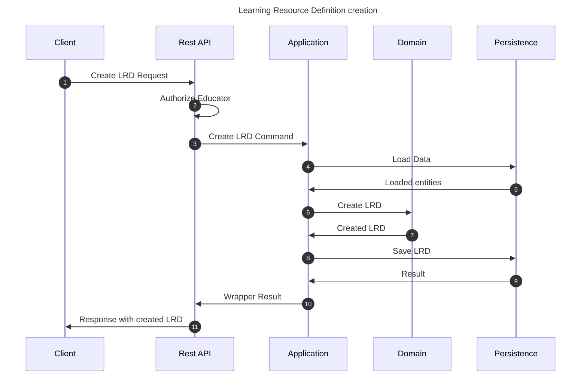

# Create Learning Resource Definition flow

This flow creates an LRD. This may be performed by any educator.

Note that LRD is usually created together with an encompassing entity, such as Segment. Therefore, this flow is not
the only one that can create an LRD.

## Sequence diagram

## Input data

| Input                          | Type        | Required |
|--------------------------------|-------------|----------|
| Educator User Id               | Educator Id | ✅        |
| Theory description             | String      | ✅        |
| Exercise description           | String      | ✅        |
| Additional summary description | String      | ❌        |
| Additional hints description   | String      | ❌        |

## Description

Flow creates a Learning Resource Definition using provided command.
- Definition has the properties provided in the command
- Definition by default is not associated with any study program entity. 
- Only association of the LRD is within the author educator. 
