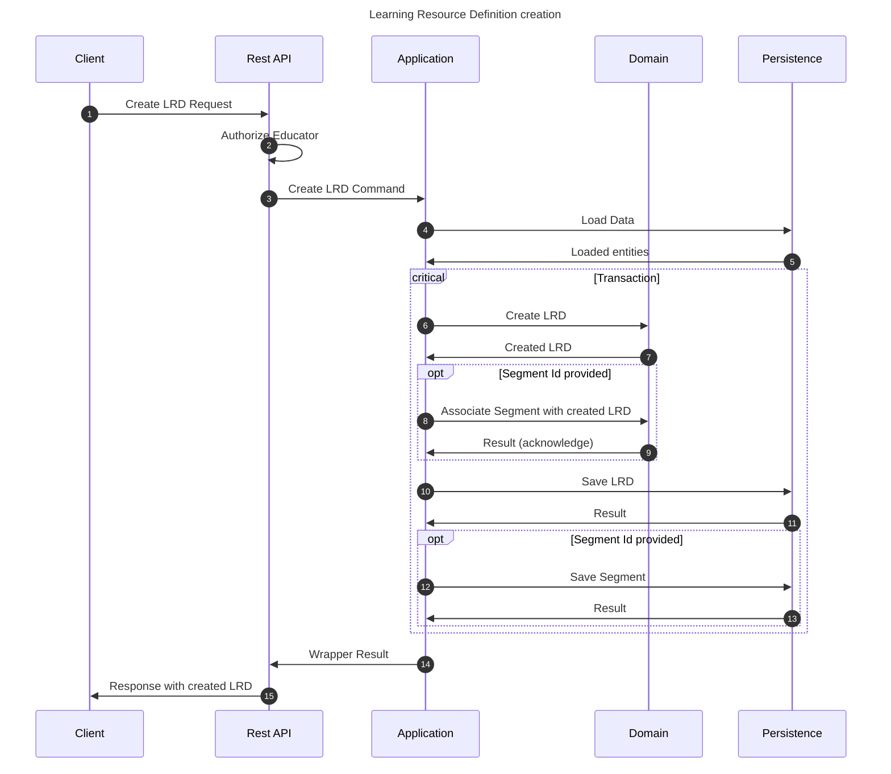

# Create Learning Resource Definition flow

This flow creates an LRD. This may be performed by any educator.

By domain understanding LRD should only be created being bounded to a study program entity.

This implementation is for alfa-testing purposes, and it allows creation of the unrelated LRD.

## Sequence diagram

## Input data

| Input                          | Type        | Required |
|--------------------------------|-------------|----------|
| Educator User Id               | Educator Id | ✅        |
| Segment Id                     | Segment Id  | ❌        |
| Theory description             | String      | ✅        |
| Exercise description           | String      | ✅        |
| Additional summary description | String      | ❌        |
| Additional hints description   | String      | ❌        |

## Description

Flow creates a Learning Resource Definition using provided command.

- Definition has the properties provided in the command
- Definition is associated with segment only if the proper segment Id is provided
- If there is no segment Id provided, the LRD is related only to the educator profile itself.
