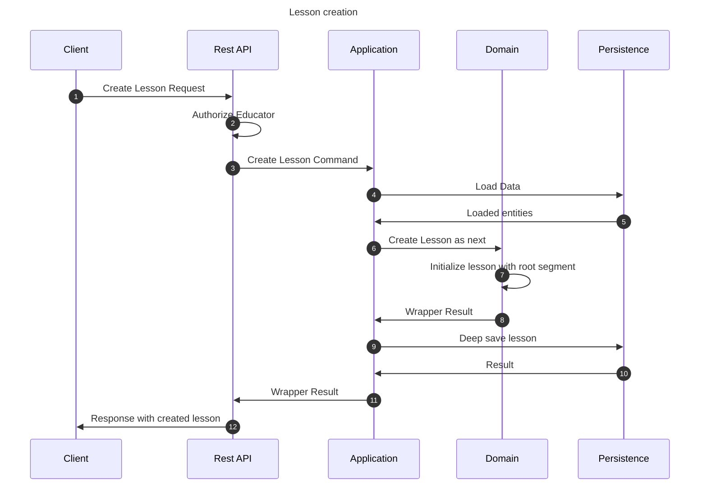

# Create lesson flow

This flow creates a lesson. This may be performed by any educator.

## Sequence diagram

## Input data

| Input              | Type        | Required |
|--------------------|-------------|----------|
| Educator User Id   | Educator Id | ✅        |
| Lesson Name        | String      | ✅        |
| Lesson Description | String      | ❌        |
| Previous Lesson Id | Lesson Id   | ✅        |
| Next Lesson Id     | Lesson Id   | ❌        |

## Description

Flow creates a course using provided command.

- Lesson uses name and description provided in the command
- Lesson is created as next in relation to the previous lesson identified by the id in the command.
- Lesson is created in between 2 lessons if there is next lesson Id provided.
- If any of the provided information is incorrect, flow does not create anything.