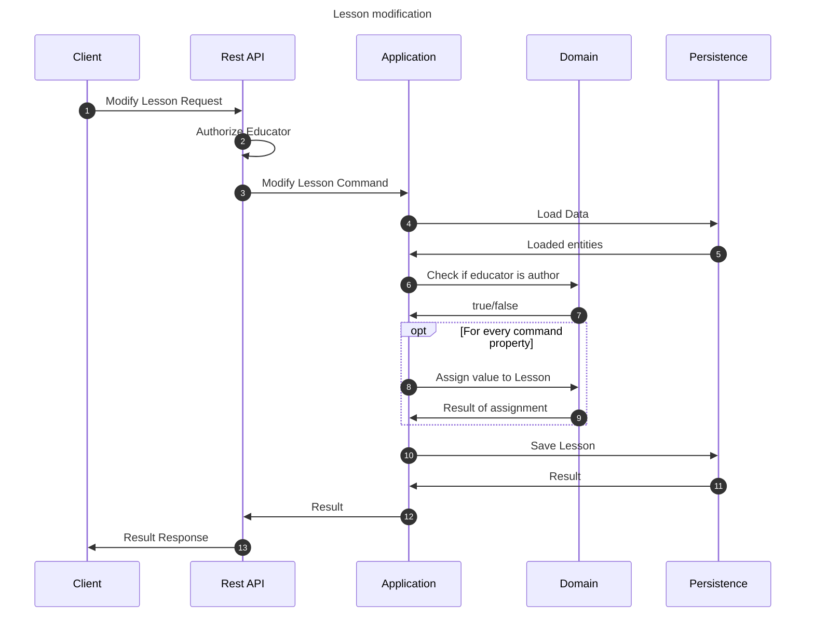

# Modify lesson flow

This flow modifies a lesson. This may be performed by any educator which is a course author.

## Sequence diagram

## Input data

| Input                      | Type        | Required |
|----------------------------|-------------|----------|
| Educator User Id           | Educator Id | ✅        |
| Lesson Id                  | Course Id   | ✅        |
| Lesson Name                | String      | ❌        |
| Lesson Snippet Description | String      | ❌        |

## Description

Flow updates course properties using the provided command.

- Lesson being modified is the lesson with id provided in the command
- Educator modifying the course must be an author of the course to modify it.
- Properties are assigned if they are provided.
    - Property is not assigned if it is assigned null explicitly or not provided in the command (assigned null
      implicitly)