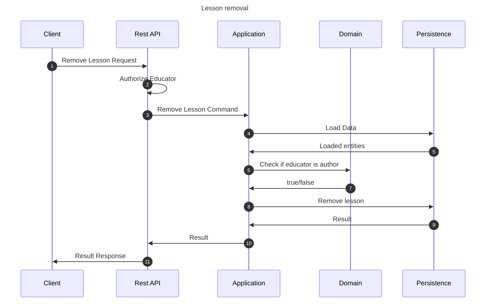

# Remove lesson flow

This flow removes a lesson. This may be performed by author educator of the lesson.

## Sequence diagram

## Input data

| Input            | Type        | Required |
|------------------|-------------|----------|
| Educator User Id | Educator Id | ✅        |
| Lesson Id        | Course Id   | ✅        |
| Remove Segments  | Boolean     | ❌        |

## Description

Flow removes the lesson from the application.

- Lesson itself is being removed.
    - Underlying segments stay in the database by default. They are removed if "Remove Segments" property is true
- Next lessons (if any) are automatically being connected to the previous element
- Lesson may be removed only by author educator