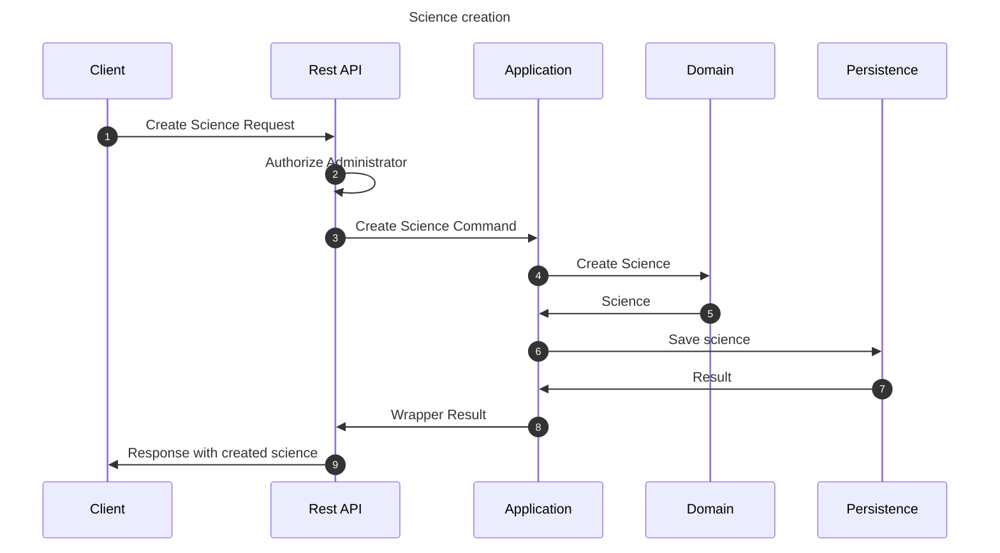

# Create science flow

This flow creates a science. This flow may be invoked by an administrator user.

## Sequence diagram

## Input data

| Input                 | Type            | Required |
|-----------------------|-----------------|----------|
| Administrator User Id | UUID Identifier | ✅        |
| Science Name          | String          | ✅        |
| Science Description   | String          | ❌        |

## Description

Flow creates a science using provided command.

- Science is inaccessible by default. It may be made accessible using modification flow.