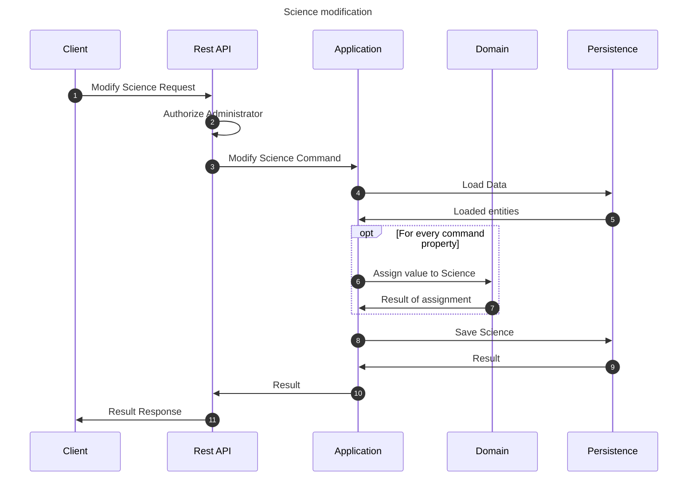

# Modify science flow

This flow modifies a lesson. This may be performed by any educator which is a lesson author.

## Sequence diagram

## Input data

| Input               | Type        | Required |
|---------------------|-------------|----------|
| Educator User Id    | Educator Id | ✅        |
| Science Id          | Course Id   | ✅        |
| Science Name        | String      | ❌        |
| Science Description | String      | ❌        |
| Accessibility       | Boolean     | ❌        |

## Description

Flow updates course properties using the provided command.

- Science being modified is the Science with id provided in the command
- Any administrator can modify any science.
- Properties are assigned if they are provided.
    - Property is not assigned if it is assigned null explicitly or not provided in the command (assigned null
      implicitly)