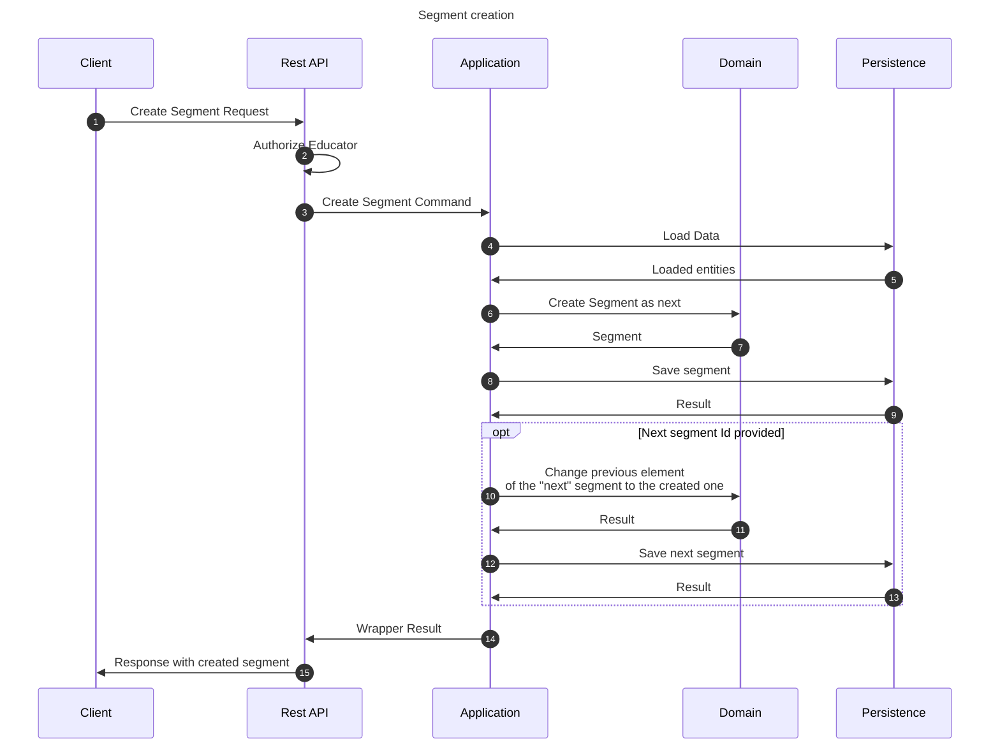

# Create segment flow

This flow creates a segment. This may be performed by any educator that has the permissions to edit contents of the
corresponding lesson.

## Sequence diagram

## Input data

| Input               | Type        | Required |
|---------------------|-------------|----------|
| Educator User Id    | Educator Id | ✅        |
| Segment Name        | String      | ✅        |
| Segment Description | String      | ❌        |
| Previous Segment Id | Lesson Id   | ✅        |
| Next Segment Id     | Lesson Id   | ❌        |

## Description

Flow creates a course using provided command.

- Segment uses name and description provided in the command
- Segment is created as next in relation to the previous segment identified by the id in the command.
- Segment is created in between 2 segments if there is next segment Id provided.
- If any of the provided information is incorrect, flow does not create anything.