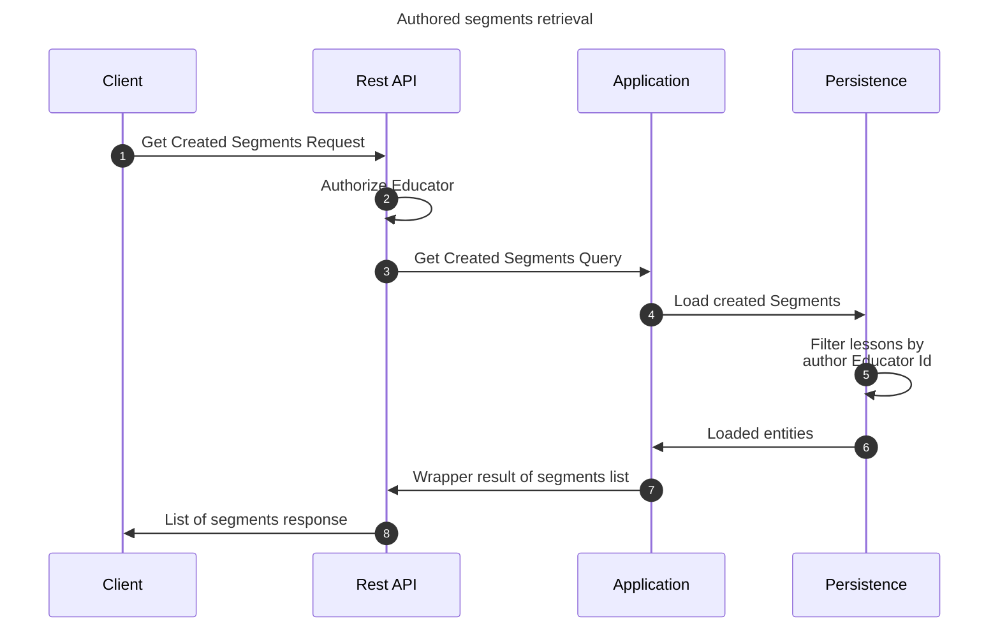

# Get created lessons flow

This flow retrieves created segments by an educator user. This may be performed by any educator.

## Sequence diagram

## Input data

| Input            | Type        | Required |
|------------------|-------------|----------|
| Educator User Id | Educator Id | ✅        |

## Description

Flow retrieves created segments by given educator user.

- User invoking the flow must be an educator