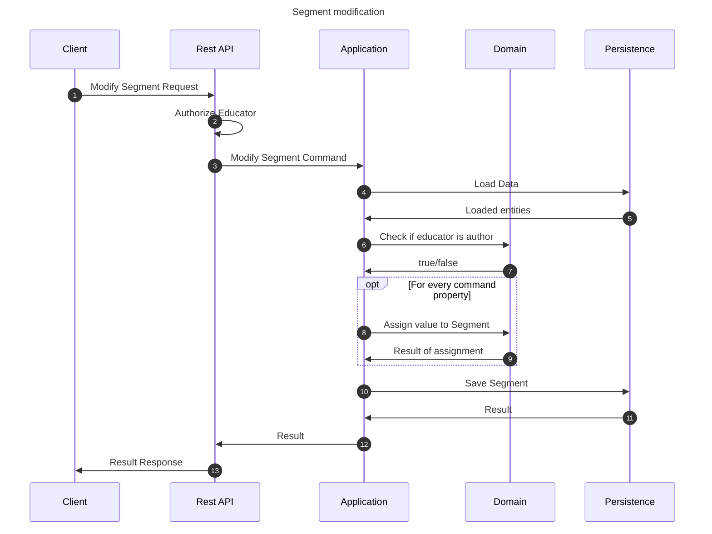

# Modify lesson flow

This flow modifies a segment. This may be performed by any educator which is a segment author.

## Sequence diagram

## Input data

| Input                       | Type        | Required |
|-----------------------------|-------------|----------|
| Educator User Id            | Educator Id | ✅        |
| Segment Id                  | Course Id   | ✅        |
| Segment Name                | String      | ❌        |
| Segment Snippet Description | String      | ❌        |

## Description

Flow updates course properties using the provided command.

- Segment being modified is the segment with id provided in the command
- Educator modifying the segment must be an author of the segment to modify it.
- Properties are assigned if they are provided.
    - Property is not assigned if it is assigned null explicitly or not provided in the command (assigned null
      implicitly)