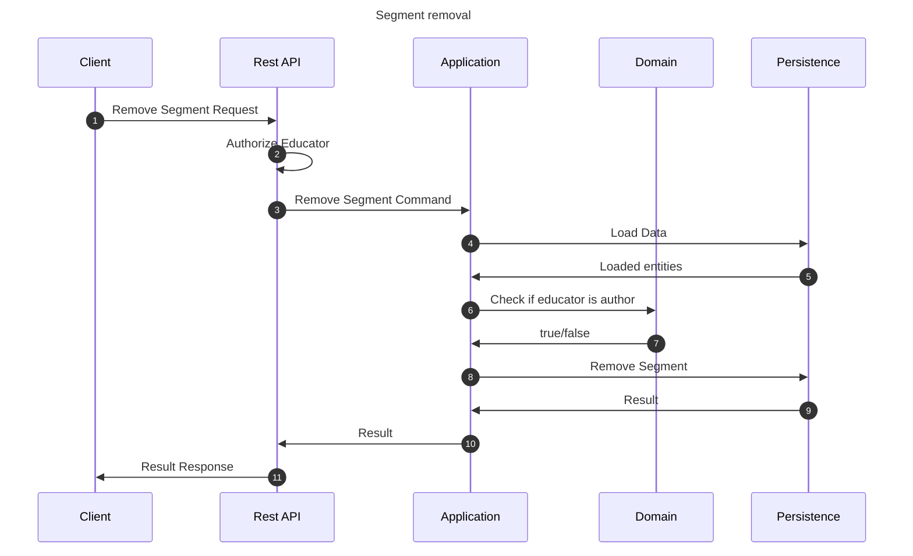

# Remove lesson flow

This flow removes a segment. This may be performed by author educator of the segment.

## Sequence diagram

## Input data

| Input            | Type            | Required |
|------------------|-----------------|----------|
| Educator User Id | UUID Identifier | ✅        |
| Segment Id       | UUID Identifier | ✅        |

## Description

Flow removes the segment from the application.

- Segment itself is being removed.
- Next segments (if any) are automatically being connected to the removed segment's previous element
- Segment may be removed only by author educator