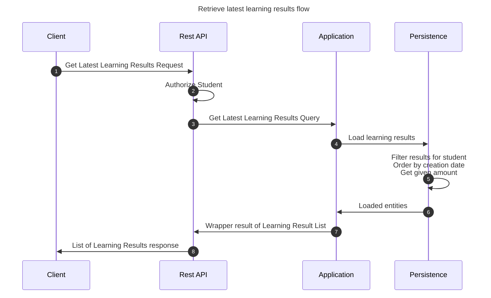

# Get latest Learning Results

This flow retrieves latest learning results created by student invoking the flow.

## Sequence diagram

## Input data

| Input                  | Type            | Required |
|------------------------|-----------------|----------|
| Student User Id        | UUID Identifier | ✅        |
| Amount                 | Integer         | ❌        |

## Description

Flow retrieves latest learning results created by student's submissions.

- User invoking the flow must be a student
- Amount defaults to 5 if not provided